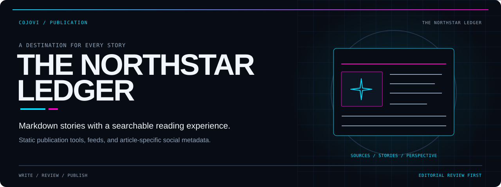
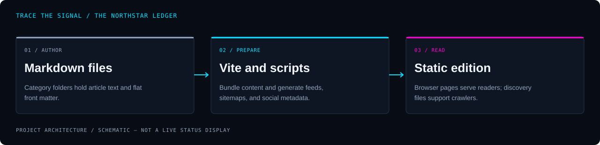

<!-- COJOVI / SIGNAL — The Northstar Ledger project edition. Keep readme-assets/ with this file. -->
<a name="top"></a>

<p align="center">
  
</p>

<h1 align="center">The Northstar Ledger</h1>

<p align="center">
  <strong>Write in Markdown. Organize the edition. Give every story a destination.</strong><br>
  A file-based news and commentary website with category pages, local search, feeds, and social metadata.
</p>

<p align="center">
  
</p>

<p align="center">
  <a href="#overview">Overview</a> ·
  <a href="#architecture">Architecture</a> ·
  <a href="#quickstart">Quickstart</a> ·
  <a href="#configuration">Content</a> ·
  <a href="#validation">Validation</a> ·
  <a href="#security">Boundaries</a>
</p>

---

<a name="overview"></a>
## `> meet_the_ledger`

**The Northstar Ledger is the publication implemented in `cojovi/northstar_news`.** Articles live in category folders as Markdown with front matter; React turns that content into a homepage, section listings, article pages, and a search experience.

Its core reading experience uses **React 18, TypeScript, Vite 5, Tailwind CSS, and react-markdown**. A database is not required to browse articles. Supabase is an optional, separate newsletter-subscription integration.

| Read | Discover | Distribute |
| :--- | :--- | :--- |
| Browse category pages, article bodies, and related stories. | Search titles, summaries, tags, and body text in the browser. | Generate sitemaps, RSS/Atom feeds, and article-specific social metadata. |

> [!IMPORTANT]
> **This is a static publication frontend, not a live newsroom backend.** Content changes require a rebuild for production. The repository includes sample material and AI-assisted authoring tools; publishing status, professional presentation, and metadata do not establish factual accuracy or editorial review.

<a name="architecture"></a>
## `> trace_the_edition`

<p align="center">
  
</p>

```text
content/{category}/*.md + public assets
                  ↓
Vite + publication tooling
├─ raw Markdown → browser content loader → React pages
├─ sitemap script → sitemap index + feeds
├─ OG manifest → public JSON + index.html injection
└─ build plugin → article-specific HTML metadata
                  ↓
Static hosting: reading UI + crawler metadata + discovery files
```

[src/lib/content.ts](src/lib/content.ts) eagerly imports Markdown through Vite and parses it in the client bundle. Published articles are cached in memory; search is case-insensitive substring matching, not an external search service.

[scripts/generate-sitemap.js](scripts/generate-sitemap.js) writes the sitemap index, post/section/page sitemaps, and RSS/Atom feeds. [vite-plugin-prerender-og.js](vite-plugin-prerender-og.js) writes article HTML shells with social tags during builds—**not server-rendered article bodies**.

<a name="quickstart"></a>
## `> open_the_workbench`

**Prerequisites:** Git, Node.js, and npm compatible with Vite 5. [package.json](package.json) does not declare a Node engine; its package identifier remains `vite-react-typescript-starter`.

### 1. Get the source

```bash
git clone --branch main https://github.com/cojovi/northstar_news.git
cd northstar_news
```

### 2. Review external settings

Inspect `index.html` for analytics, the source files listed under [configuration](#configuration) for canonical-site values, and article assets for external image requests. Remove or replace settings that are not yours before opening a copy. Leave Supabase variables unset for a reading-only preview.

### 3. Install and start locally

```bash
npm install
npm run dev -- --host 127.0.0.1
```

Use **http://127.0.0.1:5173**, or the address Vite prints. No Python authoring tool or AI-provider key is needed for this frontend preview.

**Development has file-write side effects:** `dev` and `build` first generate sitemaps/feeds and an OG manifest. The manifest script also rewrites the root `index.html`. Review those changes rather than treating every generated diff as a hand-authored edit.

The current Vite configuration does **not** register the tracked sitemap-watcher plugin. Regenerate discovery files after editing articles; do not assume they continuously refresh during a dev session.

<a name="configuration"></a>
## `> prepare_the_copy`

| Area | Where to edit |
| :--- | :--- |
| Article text and front matter | [content/](content/) and [article types](src/types/article.ts) |
| Article parsing, filtering, and search | [content.ts](src/lib/content.ts) |
| Site URL and social-image fallback | [socialImage.js](src/lib/socialImage.js) |
| Sitemap/feed site URL | [generate-sitemap.js](scripts/generate-sitemap.js) |
| Manifest URL construction | [generate-og-manifest.js](scripts/generate-og-manifest.js) |
| Analytics, default metadata, feed discovery | [index.html](index.html) |
| Hosting redirects and rewrites | [vercel.json](vercel.json) |
| Theme state and styling | [ThemeContext.tsx](src/lib/ThemeContext.tsx) and [tailwind.config.js](tailwind.config.js) |

Canonical-site values are spread across source files, not controlled by one environment variable. Adapt them together for a new deployment. Article image paths resolve from `public/`; check image rights and attribution separately from code ownership.

### Optional newsletter

[src/lib/supabase.ts](src/lib/supabase.ts) reads `VITE_SUPABASE_URL` and `VITE_SUPABASE_ANON_KEY`. Both must be present to create the client. These `VITE_` values are browser-visible; never substitute a service-role key.

[HomePage.tsx](src/components/HomePage.tsx) inserts `email`, `subscribed_at`, and `source` into `newsletter_subscriptions`. Without configuration, subscribing returns an unavailable message. This is address collection—not an implemented newsletter delivery service.

[NEWSLETTER_SETUP.md](NEWSLETTER_SETUP.md) describes separate database and notification setup. Review its policies rather than copying them blindly: its authenticated-read example is not restricted to administrators. Add consent, least-privilege access, and abuse controls before enabling collection.

<a name="usage"></a>
## `> write_and_review`

Create an article in `content/{category}/{slug}.md`. Available section paths include `us`, `world`, `politics`, `business`, `tech`, `health`, `entertainment`, `sports`, `opinion`, `lifestyle`, and `travel`.

The following is an **illustrative draft**, not a real report. Supply your own reviewed content and licensed image; the example image path is a placeholder.

```yaml
---
title: "Example editorial draft"
dek: "A short description for readers."
slug: example-editorial-draft
category: tech
tags: ['example', 'editorial']
author: "Example Editor"
author_slug: example-editor
published: "2026-01-01T12:00:00Z"
updated: "2026-01-01T12:00:00Z"
hero_image: /images/example-hero.jpg
hero_credit: "Replace with the image credit"
thumbnail: /images/example-hero.jpg
excerpt: "A short listing summary."
reading_time: 3
status: draft
is_satire: false
---
```

Add the Markdown body below the closing delimiter. Keep front matter flat, use single-line values and inline tag arrays, and save with LF line endings: the browser parser is intentionally much simpler than a full YAML parser. Build-time scripts use `gray-matter`, so complex YAML may behave differently between them.

Keep the folder, `category`, and `slug` aligned. Set `status: published` only after editorial review; the loader does not use the publication date as a scheduling gate.

> [!WARNING]
> **Draft status is not confidentiality.** The eager raw import includes Markdown before the browser filters publication status. Keep private drafts and confidential source material outside the deployed content tree.

Visit `/` for the homepage, `/{category}` for a section, `/{category}/{slug}` for an article, `/search` for search, and `/about` for the publication introduction. Unknown one-segment paths are interpreted as categories, not dedicated information pages.

### Optional authoring tools

The Python helpers under [content/](content/) are separate from the website. They can call paid text/image/search providers, fetch external URLs, and write articles and artwork. Git-enabled variants can also commit and push; some enable this by default through `AUTO_COMMIT`.

Review a chosen script's dependencies, environment loading, defaults, and publication behavior before using it. Do not assume [requirements.txt](content/requirements.txt) covers every newer variant. Generated articles can default to `published` and `is_satire: false`; neither setting is a substitute for human review or visible satire labeling.

<a name="validation"></a>
## `> check_the_edition`

The repository defines these maintainer checks:

```bash
npm run typecheck
npm run lint
npm test
npm run test:build
npm run preview -- --host 127.0.0.1
```

`test:build` builds the site and checks generated social metadata. `preview` serves the built `dist/` output. The tracked tests focus on social-image resolution and crawler HTML, not every application interaction.

**Application builds and tests were not run for this documentation work.**

- [ ] Check article fields, dates, citations, authorship, image rights, and satire disclosures.
- [ ] Keep confidential drafts out of the build input, regardless of status.
- [ ] Confirm search, category listings, direct article URLs, and browser history.
- [ ] Inspect generated feeds, sitemaps, image URLs, and canonical metadata.
- [ ] Review feed links: the custom router currently intercepts ordinary same-origin anchors, including the footer RSS link.
- [ ] Replace or implement footer links for contact, standards, privacy, and terms; dedicated pages are not currently defined.
- [ ] Check keyboard navigation, theme contrast, and mobile reading layouts.
- [ ] Validate hosting rewrites for feeds/assets as well as article HTML and SPA fallback.
- [ ] Use an isolated test database and separate authorization before any subscription test.

<a name="source-map"></a>
## `> explore_the_source`

| Path | Responsibility |
| :--- | :--- |
| [src/App.tsx](src/App.tsx) | Custom path router, history handling, and shared layout. |
| [src/components/](src/components/) | Homepage, categories, articles, search, header, and footer. |
| [src/lib/](src/lib/) | Content, theme, Supabase, social images, and supporting utilities. |
| [scripts/](scripts/) | Sitemap/feed generation, manifests, and metadata verification. |
| [tests/social-metadata.test.js](tests/social-metadata.test.js) | Social metadata regression tests. |
| [vite.config.ts](vite.config.ts) | React and build-time OG prerender plugin registration. |
| [CLAUDE.md](CLAUDE.md) | Maintenance guidance; reconcile older claims with current code. |

<a name="security"></a>
## `> publish_deliberately`

- Loading the page can contact analytics and external asset hosts. Review these independently of optional newsletter submission.
- No authentication layer protects bundled article data. Supabase policies govern subscription records, not access to the static site.
- `is_satire` is part of the data model but is not rendered as a visible article label by the current article component. Make disclosures explicit in reader-facing content.
- No GitHub Actions workflow is tracked. Hosting configuration and Git-pushing authoring tools exist, but actual hosting-account deployment triggers were not verified.

### Identity and license

The project is **The Northstar Ledger**, maintained in [cojovi/northstar_news](https://github.com/cojovi/northstar_news); GitHub metadata does not mark it as a fork. Its original README's “as-is for demonstration purposes” wording is not a standard license grant.

**No root license file was found in the reviewed revision.** Clarify reuse rights with the owner and retain applicable dependency and media notices. Repository availability does not establish rights to republish every article or image.

---

<p align="center">
  
</p>

<p align="center">
  <strong>Readable stories. Reviewable sources. Deliberate publication.</strong><br>
  <sub>A <a href="https://github.com/cojovi">Cody / cojovi</a> project · <a href="https://cojovi.com">cojovi.com</a><br>
  The Northstar Ledger · Presented in COJOVI / SIGNAL.</sub>
</p>

<p align="center"><a href="#top">↑ Back to the signal</a></p>
